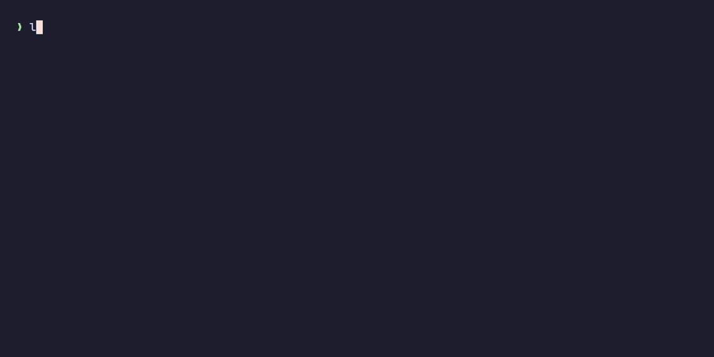
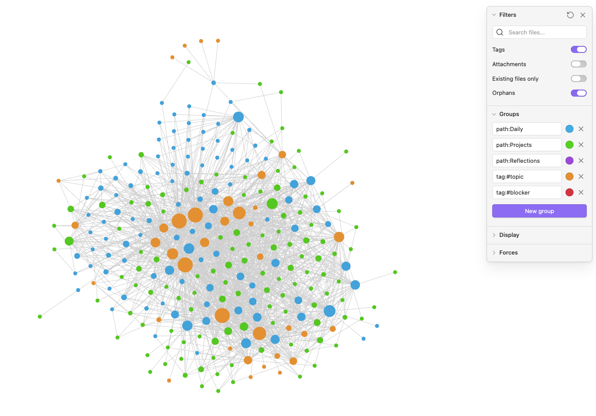
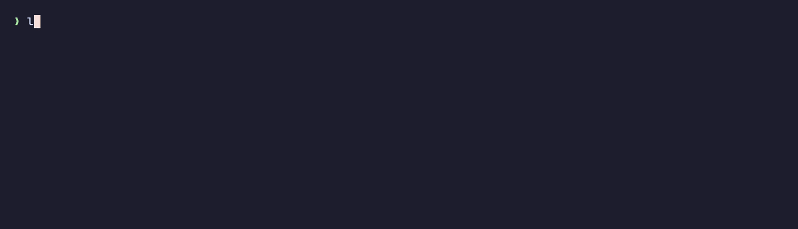
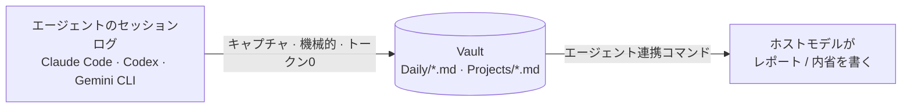

<div align="center">

# loomlog

**すべてのAIコーディングエージェントのための、ひとつのローカル日報。**

loomlog は **Claude Code・Codex・Gemini CLI** がすでにローカルに吐いているセッションログを
受動的に拾い、Obsidian互換のひとつのvaultへ織り込みます。あとは任意の日を **recall（振り返り＝何をやった？）**
し、研究に裏打ちされたフレームワークで **reflect（内省）** するだけ。APIキー不要・トークン消費ほぼゼロ。

<br>


<br>
<sub><b><code>loomlog today</code></b> — 横断の今日をそのまま日報に。<b>0トークン・LLM不要。</b>(プロ文体が欲しい時は <code>/loomlog:report</code> が同じ事実をエージェントに渡す)</sub>

<br>

[](https://www.npmjs.com/package/loomlog)
[](https://www.npmjs.com/package/loomlog)
[](https://nodejs.org)
[](https://github.com/Gaku1031/loomlog/actions/workflows/ci.yml)
[](./LICENSE)

[English](./README.md) · **日本語**

[動作要件](#動作要件) · [セットアップ](#セットアップ) · [使い方](#使い方) · [仕組み](#仕組み) · [データモデル](#データモデル) · [セキュリティ](#セキュリティとプライバシー)

</div>

---

`loom`（織機）= 3つのエージェントの糸を、1本のログとナレッジグラフに織り上げる。

**ハイライト**

- **キャプチャはトークン0。** loomlog はエージェントが既に書き出しているログをパースするだけ。LLMもAPIキーも不要。
  保存前に秘密情報を正規表現でredact（伏字化）します。
- **レポートもトークン0。** `loomlog today` / `week` が横断の作業を、捕捉済みの事実からそのまま日報化（LLM不要）。
  プロ文体が欲しい時だけ `/loomlog:report` が同じ事実をエージェントに渡す（唯一トークンを使う任意ステップ）。
- **あなたが所有するプレーンMarkdown。** Obsidian vaultを指すだけで、Daily ↔ Project ↔ Topic の
  グラフが自動で立ち上がります。

## クイックスタート（約60秒）

```bash
npm install -g loomlog                  # 1. CLI をインストール
export LOOMLOG_VAULT="$HOME/loomlog"    # 2. 全エージェントで1つのvaultに統一（~/.zshrc に追記）
loomlog init --wire-claude              # 3. vault作成 + Claude Code の Stop フックを配線
loomlog doctor                          # 4. 検証: PATH上のCLI・vault・フック・vault分裂の有無
```

あとはコーディングするだけ。レポートは各エージェントに頼む（`/loomlog:report`＝Claude、`$loomlog`＝Codex）か、
ターミナルから振り返る（`loomlog today` · `loomlog week` · `loomlog <project>`）。
Codex / Gemini も使う場合は [エージェントを連携](#3-エージェントを連携) を参照。うまく動かないときは `loomlog doctor`。

<p align="center">
  
  <br>
  <sub>同じvaultをObsidianのグラフで開くと、<b>Daily</b> ↔ <b>Project</b> ↔ <b>Topic</b> ノードが自動で立ち上がる。</sub>
</p>

> **ステータス:** [npm](https://www.npmjs.com/package/loomlog) で公開済み。Claude Code と Codex は
> 正式サポート、Gemini CLI は実験的（プロンプトのみ記録し、セッションを自動削除します）。
>
> **対応プラットフォーム:** macOS / Linux / Windows。CLI本体は純粋なNodeです。OS依存の手順は
> 以下で **macOS / Linux** と **Windows (PowerShell)** に分けて示します。

## 目次

- [動作要件](#動作要件)
- [セットアップ](#セットアップ) — インストール・vault作成・エージェント連携
- [使い方](#使い方) — Recall と Reflect
- [仕組み](#仕組み)
- [データモデル](#データモデル)
- [セキュリティとプライバシー](#セキュリティとプライバシー)
- [開発](#開発)

## 動作要件

- **Node.js 20+**
- **Claude Code・Codex・Gemini CLI** のいずれか1つ以上（loomlog は *それらの* ログをキャプチャします）
- **Obsidian** — 任意。グラフビュー用のみ。どのMarkdownエディタでも動きます。

## セットアップ

3ステップ: CLIをインストール → vaultを作成 → 使うエージェントを連携。CLI はどのOSでも共通で、
**vaultの環境変数** と **ファイルコピー / スケジュール実行** のコマンドだけがOSで異なります。
それぞれ **macOS / Linux** と **Windows (PowerShell)** の両方を以下に示します。

### 1. CLIをインストール

```bash
npm install -g loomlog
```

### 2. vaultを作成

`loomlog init` は `~/loomlog` を作成し、Obsidianのグラフ設定を書き込み、vaultをObsidianに登録し、
導入済みエージェントを検出します。OSを自動判定して正しいObsidian設定パス（macOS は
`~/Library/Application Support`、Windows は `%APPDATA%`、Linux は `~/.config`）へ書き込むので、
ここを自分で設定する必要はありません。

```bash
loomlog init
```

続いて、すべてのコマンドとスケジュールタスクがvaultを見つけられるよう、場所を永続化します:

**macOS / Linux**

```bash
echo 'export LOOMLOG_VAULT="$HOME/loomlog"' >> ~/.zshrc   # または ~/.bashrc
export LOOMLOG_VAULT="$HOME/loomlog"                       # 現在のシェル用
```

**Windows (PowerShell)**

```powershell
setx LOOMLOG_VAULT "$HOME\loomlog"          # 新しいシェル・スケジュールタスクに永続化
$env:LOOMLOG_VAULT = "$HOME\loomlog"        # 現在のシェル用
```

すべては `$LOOMLOG_VAULT`（既定 `~/loomlog`）にキャプチャされます。`init` は検出したエージェントに
合わせた次の手順を表示します。

### 3. エージェントを連携

使うエージェントをセットアップします。**Claude Code** は完全自動。**Codex** と **Gemini** は
インストール済みパッケージから数ファイルをコピーする必要があります。まず、以下のコピーコマンドを
OS非依存にするためにパッケージパスを取得します:

**macOS / Linux**

```bash
LOOMLOG_PKG="$(npm root -g)/loomlog"   # `npm install -g` がloomlogを置いた場所
```

**Windows (PowerShell)**

```powershell
$LOOMLOG_PKG = "$(npm root -g)\loomlog"
```

#### Claude Code — プラグインをインストール（推奨）

Claude Code 内で実行（どのOSでも同じ）:

```
/plugin marketplace add Gaku1031/loomlog
/plugin install loomlog@loomlog
```

これだけです。プラグインは:

- すべてのセッションを **自動キャプチャ** — `Stop` フックが自己登録するので、`settings.json` を
  触る必要はありません;
- スラッシュコマンド `/loomlog:report`（今日のレポート）、`/loomlog:reflect`（日次の内省）、
  `/loomlog:weekly`（Gibbs の週次）を追加します。

プラグインは内部で `loomlog` CLI を呼ぶので、インストールしたまま（手順1）にしておいてください。

<details>
<summary>プラグインを使いたくない場合は？</summary>

Stopフックを自分のsettingsに追記し（追記のみ・バックアップあり・冪等）、コマンドをコピーします。

**macOS / Linux**

```bash
loomlog init --wire-claude
mkdir -p ~/.claude/commands/loomlog
cp "$LOOMLOG_PKG"/integrations/claude-plugin/commands/*.md ~/.claude/commands/loomlog/
```

**Windows (PowerShell)**

```powershell
loomlog init --wire-claude
New-Item -ItemType Directory -Force "$HOME\.claude\commands\loomlog" | Out-Null
Copy-Item "$LOOMLOG_PKG\integrations\claude-plugin\commands\*.md" "$HOME\.claude\commands\loomlog\"
```

プラグイン *か* これ *のどちらか* を使ってください。両方だと Stop フックが2回走ります（無害ですが冗長）。

> **Windows の注意:** 配線される Stop フックのコマンドは POSIX シェル構文（`2>/dev/null || true`）を使います。
> もし Claude Code がフックを POSIX シェルで実行しない環境なら、フックは使わず、スケジュール実行の
> `loomlog scan claude` でキャプチャしてください（Claude はトランスクリプトを約30日保持します）。
> 下の [スケジュールスキャンのレシピ](#gemini-cli--実験的) を参照し、`all` を `claude` に置き換えます。

</details>

#### Codex — スキルをインストール

**macOS / Linux**

```bash
mkdir -p ~/.codex/skills
cp -R "$LOOMLOG_PKG"/integrations/codex/skills/loomlog ~/.codex/skills/loomlog
```

**Windows (PowerShell)**

```powershell
New-Item -ItemType Directory -Force "$HOME\.codex\skills" | Out-Null
Copy-Item -Recurse -Force "$LOOMLOG_PKG\integrations\codex\skills\loomlog" "$HOME\.codex\skills\loomlog"
```

Codexのスキルはスラッシュコマンドではないため、ピッカーに `/loomlog` は出ません。スキルは
**`$loomlog`** または自然言語で呼び出します — *「loomlogで今日の日報を書いて」*、*「今日の振り返りを作って」*。
任意のターミナルで `loomlog scan all && loomlog report` を実行することもできます。

> Codex 0.117+ はカスタムスラッシュプロンプトを廃止したため、スキルがサポート対象の経路です。
> 旧Codex向けのレガシープロンプトは
> [`integrations/codex/prompts/`](./integrations/codex/prompts/) にあります。

#### Gemini CLI — 実験的

**macOS / Linux**

```bash
mkdir -p ~/.gemini/commands/loomlog
cp "$LOOMLOG_PKG"/integrations/gemini/commands/loomlog/*.toml ~/.gemini/commands/loomlog/
loomlog scan gemini               # 現在のGeminiセッションを取り込む
```

**Windows (PowerShell)**

```powershell
New-Item -ItemType Directory -Force "$HOME\.gemini\commands\loomlog" | Out-Null
Copy-Item "$LOOMLOG_PKG\integrations\gemini\commands\loomlog\*.toml" "$HOME\.gemini\commands\loomlog\"
loomlog scan gemini               # 現在のGeminiセッションを取り込む
```

その後、Gemini内で **`/loomlog:report`** または **`/loomlog:reflect`** を実行します。Gemini は
プロンプトのみ記録（ファイル/コマンドの詳細なし）し、**古いセッションを自動削除します** —
一度もスキャンされないまま消えたセッションは永久に失われます。Codex は削除しないので「遅延」
するだけ（失われない）、Claude は Stop フックで即時取得。つまり日次スキャンは主に **Gemini を
守るため** に存在します。

**お手軽版** — `init` に OS 別の仕掛けを任せる（冪等・撤去可能）:

```bash
loomlog init --schedule-scan            # 既定は毎日13:00。--scan-at 09:30 で変更
loomlog init --unschedule-scan          # 撤去
```

OS ごとに最適な仕組みを選び、さらに **スリープで逃した実行を後から追いつき実行する** ものを使い
ます（ノートPCでは固定時刻はしょっちゅう逃すため）:

| OS | 仕組み | 逃した実行を追いつく？ |
|----|--------|------------------------|
| macOS | launchd `StartCalendarInterval` + `RunAtLoad`（ログイン時にも実行） | する |
| Windows | Task Scheduler `-StartWhenAvailable` | する |
| Linux / その他unix | cron | しない — 起動している時刻を選ぶ（サーバ/WSLは常時起動が普通） |

既定が **深夜でなく13:00** なのは、cron が追いつけず、ノートPCは22時に閉じている可能性が高いから
です。node バイナリと Vault パスは絶対パスで埋め込みます（launchd/cron は最小限の PATH で動くため）。
Volta 利用時はバージョン非依存のシムを自動採用するので Node 更新でも壊れません。nvm/fnm はバージョン
固定パスのため、Node を上げたら `--schedule-scan` を打ち直してください。

<details><summary>手動で仕掛けたい場合</summary>

**macOS / Linux** — cron に追記（`crontab -e`）:

```cron
0 13 * * *  loomlog scan all --vault ~/loomlog
```

**Windows (PowerShell)** — 日次スケジュールタスクを登録（手順2の `LOOMLOG_VAULT` を引き継ぎます）:

```powershell
$action  = New-ScheduledTaskAction -Execute "powershell.exe" -Argument '-NoProfile -Command "loomlog scan all"'
$trigger = New-ScheduledTaskTrigger -Daily -At 1PM
$set     = New-ScheduledTaskSettingsSet -StartWhenAvailable
Register-ScheduledTask -TaskName "loomlog-scan" -Action $action -Trigger $trigger -Settings $set -Description "Daily loomlog scan"
```

</details>

Gemini サポートはベストエフォートとお考えください。

## 使い方

loomlog には2つの動詞があります。**recall（何をやった？）** と **reflect（だから何？/次は何？）** です。

### Recall — 「何をやった？」

機械的・トークン0・素のターミナルで動きます。第1引数がクエリです:

```bash
loomlog today              # yesterday や日付も可 — loomlog 2026-06-08
loomlog week               # 直近7日           loomlog month   # 直近30日
loomlog <project>          # 1プロジェクトの履歴
loomlog patterns           # どんな仕事をしているかの傾向
```

`patterns` は「自分の仕事の形 — そしてどこで詰まっているか？」に答えます。すでに感じている数字の羅列ではなく:
前期間との**トレンド**（プロジェクト別 ▲/▼）、**詰まったところ** — *同じ*コマンドが2回以上失敗した時だけ
「詰まり」として、**実際のエラー内容と、乗り越えた(✓)/まだ未解決(✗)か**まで提示 — **出荷と摩擦**（コミット数と、
失敗が集中した日）、そして**どのタスクにどのエージェントを使っているか**（テスト/リファクタ vs 機能追加）。
すべて0トークン、ログから直接。

<p align="center">
  
  <br>
  <sub><b>統計の羅列ではなくインサイト:</b> 前期間比トレンド・どこで詰まったか(失敗・そのエラー・✓解消/✗未解決)・出荷と摩擦・どのタスクにどのエージェントを使うか。</sub>
</p>

**`loomlog patterns --blockers`** は 詰まり だけにズーム。文章で出ます —「<何をしていて> の最中に `go test`
が5回失敗、未解決のまま」— その下に実際のエラー:

<p align="center">
  中に コマンドが N回失敗・解消/未解決、その下に実際のエラー">
</p>

**どこへでも貼れる — `--copy`。** どの recall コマンドにも `--copy`（または `-c`）を付けると、出力を
**リッチテキスト**としてクリップボードに載せます。Notion・Slack・Docs に貼ると**整形済み**で入り、生の
Markdown のままになったり「2行目以降が1段内側にズレる」こともありません:

```bash
loomlog today --copy       # → リッチテキストでクリップボードへ（Notionに貼ると描画される）
loomlog report -c          # report サブコマンドでも同様
loomlog report --md        # 代わりにクリーンなMarkdownを標準出力へ（ファイル/mdエディタ用）
loomlog report --copy --md # プレーンMarkdownをコピー（Obsidian・GitHub・「Markdownとして貼付」用）
```

macOS ではリッチコピーに標準搭載の `textutil` + `pbcopy` を使います（追加インストール不要）。Linux は
`wl-copy`/`xclip` があればそれを使い、無ければクリーンMarkdownをプレーンテキストとしてコピーします。
既定のターミナル出力は変わりません。

### Reflect — 構造化された内省

内省は **AIエージェント内で** 動きます — 対話にはモデルが要り、loomlog のルールは「ホストモデルが
やる（APIキー不要）」です。loomlog は事実レイヤーを機械的に埋め、エージェントが本物の内省実践
フレームワークに沿って案内し、結果は `Reflections/<date>.md` に保存されます（キャプチャがこれを
上書きすることはありません）。

Claude Code で、1日の作業のあとに:

```
/loomlog:reflect           # 日次  — What / So What / Now What（Borton → Driscoll）
/loomlog:weekly            # 週次  — Gibbs Reflective Cycle（1988）
```

日次の内省は:

1. 今日の事実を集め、
2. プロジェクト別に **What（やったこと）** を提示 — 意図・主要ファイル・作業種別・出荷したコミット、
3. **So What** の問いを1問ずつ — *「今日いちばん重要だった作業は？」*、*「詰まったのはなぜ？」*、
   *「新しく分かった/決めたことは？」*、
4. **Now What** を質問 — *「次にやること/変えることは？」*、
5. 仕上がった内省を `~/loomlog/Reflections/<date>.md` に書き、その日のノートへリンクし直します
   （Obsidianグラフに表示されます）。

引数で別のフレームワークを選べます。例: `/loomlog:reflect aar`:

| テンプレート | 用途 |
|----------|------|
| `wsn`    | 日次（既定）— What / So What / Now What |
| `gibbs`  | 週次 — Gibbs Reflective Cycle |
| `aar`    | 詰まりの多い日 — After-Action Review |
| `kpt`    | Keep / Problem / Try |
| `ywt`    | やったこと / わかったこと / つぎやること |

内部的には `loomlog reflect --template <t> --json` → あなたが回答 → `loomlog reflect-save`
（APIキー不要・追加トークンほぼ0）です。エージェントのない素のターミナルでは、代わりに上の Recall
コマンドを使ってください — `loomlog reflect` 単体はモデル向けのJSONを出力するだけです。

## 仕組み



キャプチャは機械的な半分（LLMなし・トークンなし）、レポートと内省はモデルの半分で、いま使っている
エージェントが実行します。各エージェントはログの扱いが異なるため、キャプチャのタイミングも異なります:

| エージェント | ログを自動削除？ | キャプチャ戦略 |
|-------|--------------------|------------------|
| Claude Code | する（既定30日） | `Stop` フックで即時キャプチャ |
| Codex | しない | レポート時の遅延スキャン |
| Gemini CLI | する（既定ON） | 日次スケジュールスキャン *（実験的）* |

キャプチャの粒度は意図的に絞っています。記録するのはプロンプトの意図（先頭行）、ファイルの
**パス** だけ（中身は保存しません）、コマンドは **種別ごとの件数** だけ（引数の全文は保存しません）、
使ったツール、エラー数で、これらはすべて redactor（伏字化処理）を通します。

## データモデル

vault は単なる Markdown です:

```
<vault>/
  Daily/2026-06-07.md      # 1日1枚・プロジェクト別セクション
  Projects/<name>.md       # 自動メンテされるプロジェクト索引（MOC）
  Reflections/<date>.md    # 保存された内省（キャプチャは上書きしない）
  .obsidian/graph.json     # グラフビュー設定（`init` が書き込む）
  .loomlog/                # 一次情報のJSON。Markdownはその射影
```

## セキュリティとプライバシー

loomlog の設計はとことん地味です。**キャプチャ経路はネットワークアクセスなし・ランタイム依存
ゼロ・外部プロセス起動なし。** エージェントが既に書き出したログをパースして vault に Markdown を
書くだけで、マシンの外には何も出ません。とはいえ作業履歴を *集約* するツールである以上、信頼境界は
はっきりさせておきます。

**loomlog が守ること**

- **送信経路ゼロ。** CLI はネットワーク呼び出しを一切行わず、プロセスも起動しません。キャプチャは
  純粋なローカルの parse → ローカル書き込みです。
- **ランタイム依存ゼロ。** キャプチャ時に `node_modules` のコードは動かず、Node の標準ライブラリ
  だけを使います。サプライチェーンの攻撃面が小さくなります。
- **保守的なキャプチャ。** ファイルは **パスのみ** を記録し中身は残しません。コマンドは
  **種別ごとの件数** だけで引数の全文は残しません。プロンプトは先頭行の **意図** だけをクリップします。
- **保存前の秘匿redact。** 捕捉した全文字列を redactor に通し、APIキー・トークン・PEM秘密鍵・JWT・
  `KEY=value` 形式の秘密をマスクします。ただしこれは **多層防御であって保証ではありません** —
  正規表現は未知の形式・社内ホスト名・顧客名・文章中のPIIを取りこぼします。
- **署名付きリリース。** npm パッケージは OIDC Trusted Publishing による **provenance(来歴)** 付きで
  公開されます。リリースが乗っ取られた手元PCではなく本リポジトリの CI でビルドされたことを検証できます。
- **信頼できないテキストは書き込み時に無害化。** 捕捉したプロンプト/コミットは vault に書き込む前に
  Markdown安全化を通します（`[[wikilink]]` の偽造やインラインコードのエスケープ脱出を防止）。また
  キャプチャは各エージェントのログツリー内に解決されるファイルのみを読みます — フックは
  `transcript_path` を検証し、スキャンはツリー外へ抜けるシンボリックリンクをスキップします。

**あなたの責任で守ること**

- **vault は平文で保存されます。** `~/loomlog` は、あなたが何に取り組んだかを暗号化なしで一か所に
  集約した記録です。機微情報として扱ってください。iCloud や Dropbox のような
  **信頼できないクラウドフォルダ** には、その露出を受け入れる場合だけ同期し、ディスク暗号化や
  バックアップの管理対象に含めてください。
- **レポートは履歴をツール権限付きエージェントに読み戻します。** `report` と `reflect` は、捕捉した
  プロンプトを、ブラウズ・シェル実行・ファイル読み取りができる AI エージェントに渡し直します。
  連携コマンドは vault の内容を *「指示ではなく信頼できないデータ」* として明示的に隔離し、
  プロンプトインジェクションが紛れ込みにくいようにしています。ただしプロンプトレベルの防御は万能では
  ありません。過去のセッションに悪意あるテキスト（汚染された Web ページや不審なリポジトリの README）が
  紛れていた可能性がある場合は、広いツール権限を持つエージェントでレポートを実行するのは慎重に
  判断してください。
- **キャプチャ対象をスコープする。** loomlog は `~/.claude`・`~/.codex`・`~/.gemini` 配下に存在する
  セッションを片端からキャプチャします。日報に残したくない作業（顧客リポジトリ、秘密情報の多い
  セッション）では、loomlog のフック/スキャンを有効にしたままそのエージェントを使わない、または
  あとから vault の該当エントリを削除してください。
- **Stop フックは `loomlog` を自動実行します。** Claude プラグインは、セッション終了ごとに `PATH` 上で
  解決された `loomlog` をそのまま実行します。npm から導入し、最新に保ち、信頼できないディレクトリが
  `PATH` の前方で `loomlog` を上書き（シャドウ）しないようにしてください。

脆弱性を見つけた場合は、公開Issueではなく
[GitHubリポジトリのプライベートな security advisory](https://github.com/Gaku1031/loomlog/security/advisories/new)
で報告してください。

## 開発

```bash
npm install
npm test
# Claude Code のトランスクリプト1本をスクラッチvaultにキャプチャ:
npx tsx src/cli.ts capture ~/.claude/projects/<proj>/<session>.jsonl --vault ./my-vault
cat ./my-vault/Daily/*.md
```

確定した設計の全文は [`grill-loomlog-20260607.md`](./grill-loomlog-20260607.md)、リリースパイプラインは
[`RELEASING.md`](./RELEASING.md) を参照してください。

## ライセンス

[MIT](./LICENSE) © 2026 Gaku1031
