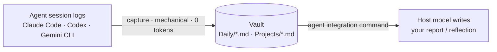

<div align="center">

# loomlog

**One local journal for every AI coding agent.**

loomlog passively weaves the sessions **Claude Code**, **Codex**, and **Gemini CLI**
already log into one Obsidian-compatible vault — then lets you **recall** any day
("what did I do?") and **reflect** with research-backed frameworks. No API key. Token-cheap.

<br>

[](https://www.npmjs.com/package/loomlog)
[](https://www.npmjs.com/package/loomlog)
[](https://nodejs.org)
[](https://github.com/Gaku1031/loomlog/actions/workflows/ci.yml)
[](./LICENSE)

**English** · [日本語](./README.ja.md)

[Requirements](#requirements) · [Setup](#setup) · [Using loomlog](#using-loomlog) · [How it works](#how-it-works) · [Data model](#data-model) · [Security](#security--privacy)

</div>

---

`loom` = the three agents' threads, woven into one log and knowledge graph.

**Highlights**

- **0 tokens to capture.** loomlog just parses the logs your agents already write — no LLM,
  no API key. Secrets are redacted before anything is stored.
- **Reports run inside your agent.** The host model formats them through each agent's native
  command, so there's no extra service and no cost.
- **Plain Markdown you own.** Point it at an Obsidian vault and the Daily ↔ Project ↔ Topic
  graph lights up automatically.

> **Status:** published on [npm](https://www.npmjs.com/package/loomlog). Claude Code and Codex
> are fully supported; Gemini CLI is experimental (it logs prompts only and auto-deletes sessions).
>
> **Platforms:** macOS, Linux, and Windows. The CLI is pure Node; OS-specific steps below are
> marked **macOS / Linux** and **Windows (PowerShell)**.

## Contents

- [Requirements](#requirements)
- [Setup](#setup) — install, create a vault, connect your agent
- [Using loomlog](#using-loomlog) — Recall and Reflect
- [How it works](#how-it-works)
- [Data model](#data-model)
- [Security & privacy](#security--privacy)
- [Development](#development)

## Requirements

- **Node.js 20+**
- At least one of **Claude Code**, **Codex**, or **Gemini CLI** (loomlog captures *their* logs)
- **Obsidian** — optional; only for the graph view. Any Markdown editor works.

## Setup

Three steps: install the CLI, create a vault, then connect each agent you use. The CLI is the
same everywhere; only the **vault env var** and the **file-copy / scheduling** commands differ
by OS, and each of those is shown for both **macOS / Linux** and **Windows (PowerShell)** below.

### 1. Install the CLI

```bash
npm install -g loomlog
```

### 2. Create your vault

`loomlog init` creates `~/loomlog`, writes the Obsidian graph config, registers the vault with
Obsidian, and detects your agents. It auto-detects your OS and writes to the correct Obsidian
config path (`~/Library/Application Support` on macOS, `%APPDATA%` on Windows, `~/.config` on
Linux) — you don't configure that yourself.

```bash
loomlog init
```

Then make the vault location permanent so every command and scheduled task can find it:

**macOS / Linux**

```bash
echo 'export LOOMLOG_VAULT="$HOME/loomlog"' >> ~/.zshrc   # or ~/.bashrc
export LOOMLOG_VAULT="$HOME/loomlog"                       # for the current shell
```

**Windows (PowerShell)**

```powershell
setx LOOMLOG_VAULT "$HOME\loomlog"          # persists for new shells & scheduled tasks
$env:LOOMLOG_VAULT = "$HOME\loomlog"        # for the current shell
```

Everything is captured into `$LOOMLOG_VAULT` (default `~/loomlog`). `init` prints tailored next
steps for whichever agents it finds.

### 3. Connect your agent

Set up whichever agent(s) you use. **Claude Code** is fully automated; **Codex** and **Gemini**
need a few files copied from the installed package. First capture the package path so the copy
commands below are OS-agnostic:

**macOS / Linux**

```bash
LOOMLOG_PKG="$(npm root -g)/loomlog"   # where `npm install -g` put loomlog's files
```

**Windows (PowerShell)**

```powershell
$LOOMLOG_PKG = "$(npm root -g)\loomlog"
```

#### Claude Code — install the plugin (recommended)

Inside Claude Code, run (identical on every OS):

```
/plugin marketplace add Gaku1031/loomlog
/plugin install loomlog@loomlog
```

That's it. The plugin:

- **auto-captures** every session — its `Stop` hook self-registers, so you never edit
  `settings.json`;
- adds the slash commands **`/loomlog:report`** (today's report), **`/loomlog:reflect`**
  (daily reflection), and **`/loomlog:weekly`** (Gibbs weekly).

The plugin calls the `loomlog` CLI under the hood, so keep it installed (step 1).

<details>
<summary>Prefer not to use the plugin?</summary>

Wire the Stop hook into your own settings (additive, backed up, idempotent) and copy the commands.

**macOS / Linux**

```bash
loomlog init --wire-claude
mkdir -p ~/.claude/commands/loomlog
cp "$LOOMLOG_PKG"/integrations/claude-plugin/commands/*.md ~/.claude/commands/loomlog/
```

**Windows (PowerShell)**

```powershell
loomlog init --wire-claude
New-Item -ItemType Directory -Force "$HOME\.claude\commands\loomlog" | Out-Null
Copy-Item "$LOOMLOG_PKG\integrations\claude-plugin\commands\*.md" "$HOME\.claude\commands\loomlog\"
```

Use the plugin *or* this — not both, or the Stop hook runs twice (harmless but redundant).

> **Windows note:** the wired Stop-hook command uses POSIX shell syntax (`2>/dev/null || true`).
> If your Claude Code doesn't run hooks through a POSIX shell, skip the hook and capture with a
> scheduled `loomlog scan claude` instead (Claude keeps transcripts ~30 days) — see the
> [scheduled-scan recipe](#gemini-cli--experimental) below and swap `all` for `claude`.

</details>

#### Codex — install the skill

**macOS / Linux**

```bash
mkdir -p ~/.codex/skills
cp -R "$LOOMLOG_PKG"/integrations/codex/skills/loomlog ~/.codex/skills/loomlog
```

**Windows (PowerShell)**

```powershell
New-Item -ItemType Directory -Force "$HOME\.codex\skills" | Out-Null
Copy-Item -Recurse -Force "$LOOMLOG_PKG\integrations\codex\skills\loomlog" "$HOME\.codex\skills\loomlog"
```

Codex skills aren't slash commands, so `/loomlog` won't appear in the picker. Invoke the skill
with **`$loomlog`** or plain language — *"loomlogで今日の日報を書いて"*, *"今日の振り返りを作って"*.
You can also run `loomlog scan all && loomlog report` in any terminal.

> Codex 0.117+ removed custom slash prompts, so the skill is the supported path. Legacy prompt
> files for older Codex live in
> [`integrations/codex/prompts/`](./integrations/codex/prompts/).

#### Gemini CLI — experimental

**macOS / Linux**

```bash
mkdir -p ~/.gemini/commands/loomlog
cp "$LOOMLOG_PKG"/integrations/gemini/commands/loomlog/*.toml ~/.gemini/commands/loomlog/
loomlog scan gemini               # ingest your current Gemini sessions
```

**Windows (PowerShell)**

```powershell
New-Item -ItemType Directory -Force "$HOME\.gemini\commands\loomlog" | Out-Null
Copy-Item "$LOOMLOG_PKG\integrations\gemini\commands\loomlog\*.toml" "$HOME\.gemini\commands\loomlog\"
loomlog scan gemini               # ingest your current Gemini sessions
```

Then run **`/loomlog:report`** or **`/loomlog:reflect`** in Gemini. Gemini records prompts only
(no file/command detail) and auto-deletes old sessions, so schedule a daily scan to avoid losing
history:

**macOS / Linux** — add a cron entry (`crontab -e`):

```cron
0 22 * * *  loomlog scan all --vault ~/loomlog
```

**Windows (PowerShell)** — register a daily scheduled task (it inherits `LOOMLOG_VAULT` from
step 2):

```powershell
$action  = New-ScheduledTaskAction -Execute "powershell.exe" -Argument '-NoProfile -Command "loomlog scan all"'
$trigger = New-ScheduledTaskTrigger -Daily -At 10PM
Register-ScheduledTask -TaskName "loomlog-scan" -Action $action -Trigger $trigger -Description "Daily loomlog scan"
```

Treat Gemini support as best-effort.

## Using loomlog

loomlog has two verbs: **recall** (*what* did I do?) and **reflect** (*so what / now what?*).

### Recall — "what did I do?"

Mechanical, 0 tokens, works in a plain terminal. The first argument is the query:

```bash
loomlog today              # also: yesterday, or a date — loomlog 2026-06-08
loomlog week               # last 7 days          loomlog month   # last 30
loomlog <project>          # one project's history
loomlog patterns           # what kind of work you do most
```

`patterns` answers "what kind of work do I do?" — your command-type mix, time split across
projects, agent usage, busiest days, and recent **commits** (read straight from your `git commit`
messages in the logs — your own "what I shipped" log, 0 tokens).

### Reflect — structured retrospection

Reflection runs **inside your AI agent** — the back-and-forth needs a model, and loomlog's rule is
that the host model does it (no API key). loomlog fills the factual layer mechanically; the agent
walks you through a real reflective-practice framework; the result is saved to
`Reflections/<date>.md` (capture never overwrites it).

In Claude Code, after a day of work:

```
/loomlog:reflect           # daily  — What / So What / Now What (Borton → Driscoll)
/loomlog:weekly            # weekly — Gibbs Reflective Cycle (1988)
```

A daily reflection:

1. pulls today's facts,
2. shows you **What** you did per project — intent, key files, work type, and the commits you
   shipped,
3. asks the **So What** questions one at a time — *"今日いちばん重要だった作業は？"*,
   *"詰まったのはなぜ？"*, *"新しく分かった/決めたことは？"*,
4. asks the **Now What** — *"次にやること/変えることは？"*,
5. writes the finished reflection to `~/loomlog/Reflections/<date>.md` and links it back to that
   day's note (so it shows up in the Obsidian graph).

Pick a different framework with an argument, e.g. `/loomlog:reflect aar`:

| Template | Use it for |
|----------|------------|
| `wsn`    | daily (default) — What / So What / Now What |
| `gibbs`  | weekly — Gibbs Reflective Cycle |
| `aar`    | blocker-heavy days — After-Action Review |
| `kpt`    | Keep / Problem / Try |
| `ywt`    | やったこと / わかったこと / つぎやること |

Under the hood it's `loomlog reflect --template <t> --json` → you answer → `loomlog reflect-save`
(no API key, ~0 extra tokens). In a bare terminal without an agent, use the Recall commands above
instead — `loomlog reflect` alone only prints the model-facing JSON.

## How it works



Capture is the mechanical half (no LLM, no tokens); reports and reflections are the model half,
run by whichever agent you're already in. Each agent treats its logs differently, so capture
timing differs:

| Agent | Auto-deletes logs? | Capture strategy |
|-------|--------------------|------------------|
| Claude Code | Yes (30d default) | `Stop` hook captures immediately |
| Codex | No | lazy scan at report time |
| Gemini CLI | Yes (on by default) | scheduled daily scan *(experimental)* |

Capture granularity is deliberately conservative: prompt intent (first line), file **paths**
(never contents), command **counts by category** (never full args), tools used, and error
counts — all run through a secret redactor first.

## Data model

A vault is just Markdown:

```
<vault>/
  Daily/2026-06-07.md      # one note per day, sections per project
  Projects/<name>.md       # auto-maintained project index (MOC)
  Reflections/<date>.md    # saved reflections (capture never overwrites these)
  .obsidian/graph.json     # graph view config (written by `init`)
  .loomlog/                # source-of-truth JSON; the Markdown is a projection
```

## Security & privacy

loomlog is boring on purpose: **the capture path has no network access, no runtime
dependencies, and never shells out.** It parses logs your agents already wrote and writes
Markdown to your vault — nothing leaves your machine. Still, a tool that *aggregates* your work
history deserves an explicit trust model.

**What loomlog does for you**

- **No egress.** The CLI makes zero network calls and spawns zero processes. Capture is a pure
  local parse → local write.
- **Zero runtime dependencies.** Nothing under `node_modules` runs at capture time — only Node's
  standard library. That keeps the supply-chain surface small.
- **Conservative capture.** File **paths only** (never contents), command **counts by category**
  (never full args), prompt **intent** (first line, clipped).
- **Secret redaction before storage.** Every captured string passes a redactor that masks API
  keys, tokens, PEM private keys, JWTs, and `KEY=value` secrets. This is **defense in depth, not a
  guarantee** — regexes miss unknown formats, internal hostnames, customer names, and PII in prose.
- **Signed releases.** npm packages are published via OIDC Trusted Publishing with build
  **provenance**, so you can verify a release was built from this repo's CI rather than a
  hijacked laptop.
- **Untrusted text is neutralized on write.** Captured prompts/commits are run through a
  Markdown-safe pass before landing in the vault (they can't forge a `[[wikilink]]` or break an
  inline-code span), and capture only reads files that resolve inside each agent's log tree — the
  hook validates its `transcript_path`, and scans skip symlinks that escape the tree.

**What stays your responsibility**

- **The vault is plaintext at rest.** `~/loomlog` is an unencrypted, conveniently-aggregated
  record of what you worked on. Treat it as sensitive: **don't sync it to an untrusted cloud
  folder** unless you accept that exposure, and keep it inside your disk-encryption / backup hygiene.
- **Reports re-read your history into a tool-enabled agent.** `report` and `reflect` feed captured
  prompts back to your AI agent — which can browse, run shell, and read files. The integration
  commands explicitly fence vault content as *untrusted data, never instructions*, which makes it
  harder to smuggle instructions in through a report — but no prompt-level defense is absolute. If a session ever ingested
  hostile text (a poisoned web page, a malicious repo README), be deliberate about running reports
  in an agent that has broad tool permissions.
- **Scope what gets captured.** loomlog captures whatever sessions exist under `~/.claude`,
  `~/.codex`, and `~/.gemini`. For work you never want journaled (client repos, secrets-heavy
  sessions), don't run those agents with loomlog's hook/scan active, or prune the matching entries
  from the vault afterward.
- **The Stop hook auto-runs `loomlog`.** The Claude plugin executes whatever `loomlog` resolves to
  on your `PATH` after every session ends. Install it from npm, keep it updated, and don't let an
  untrusted directory shadow it earlier on `PATH`.

Found a vulnerability? Please open a private security advisory on the
[GitHub repo](https://github.com/Gaku1031/loomlog/security/advisories/new) rather than a public issue.

## Development

```bash
npm install
npm test
# Capture one Claude Code transcript into a scratch vault:
npx tsx src/cli.ts capture ~/.claude/projects/<proj>/<session>.jsonl --vault ./my-vault
cat ./my-vault/Daily/*.md
```

See [`grill-loomlog-20260607.md`](./grill-loomlog-20260607.md) for the full locked design and
[`RELEASING.md`](./RELEASING.md) for the release pipeline.

## License

[MIT](./LICENSE) © 2026 Gaku1031
